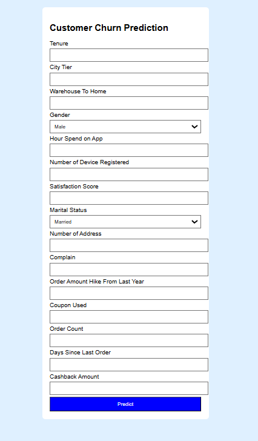
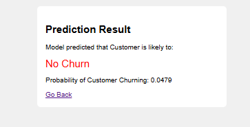

# Customer Churn Prediction Web App

This project is a machine learning web application that predicts the probability of customer churn for an e-commerce business.
It uses an XGBoost model trained on customer data to identify churn risk based on features like purchase patterns, app usage, and satisfaction scores.

The app is built with **Flask** for the backend API, packaged with **Docker**, and deployed on **AWS ECS (Fargate)** for scalable, containerized infrastructure.

---

## 🚀 Features

✅ Predicts customer churn based on form inputs  
✅ HTML/CSS frontend served by Flask  
✅ Handles categorical variables with one-hot encoding  
✅ Logs predictions to a CSV for later analysis  
✅ Dockerized for portability  
✅ Deployable on AWS ECS  
✅ Professional folder structure

---

## 🗂️ Project Structure

├── app.py
├── model.pkl
├── columns.json
├── requirements.txt
├── Dockerfile
├── templates/
│ ├── index.html
│ └── result.html
├── static/
├── prediction_logs.csv

## ⚙️ How to Run Locally

1. Clone the repo:

git clone https://github.com/yourusername/customer-churn-predictor.git
cd e-commercecustomerchurn
2. Install dependencies:

pip install -r requirements.txt
3. Start the app:

python app.py
4. Open http://localhost:5000 in your browser.

##  🐳 Docker

Build and run with Docker:

docker build -t churn-predictor .
docker run -p 5000:5000 churn-predictor

## ☁️ Cloud Deployment on AWS ECS
  Pushed Docker image to Docker Hub
  Deployed on AWS ECS (Fargate)
  Configured network with public subnet and security group to allow port 5000
  Verified public IP accessibility

## ✍️ Author

Debosmita Chatterjee
Built with ❤️ using Python, Flask, Docker, and AWS

## 📌 Future Enhancements

  Add HTTPS / TLS termination with AWS Application Load Balancer
  Store logs in CloudWatch instead of CSV
  Automate deployment with GitHub Actions

## 📷 Screenshots

## 📄 License
MIT License
